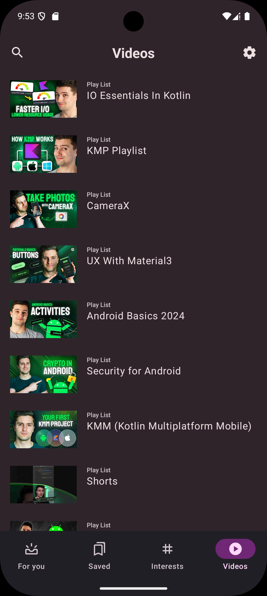

Now in Android experimental
==================

**This app adds "Videos" as a feature to the Now in Android app. The original app repository can be found [here](https://github.com/android/nowinandroid/tree/main).**

**Now in Android experimental** is a fully functional Android app built entirely with Kotlin and Jetpack Compose. It
follows Android design and development best practices and is intended to be a useful reference
for developers. As a running app, it's intended to help developers keep up-to-date with the world
of Android development by providing regular news updates.

# Added Features

**Now in Android experimental adds the following features:** 
An extra bottom navigation button called "Videos". Clicking on it will display a list of youtube playlists
from a content creator Philip Lackner who has many videos guides on Android Development. 
Clicking on a playlist will redirect the user to corresponding YouTube page for that playlist.
Googles YouTube API is used to fetch the playlists.

[Now in Android](https://developer.android.com/series/now-in-android) series. Users can browse for
links to recent videos, articles and other content. Users can also follow topics they are interested
in, and be notified when new content is published which matches interests they are following.

## Screenshots

